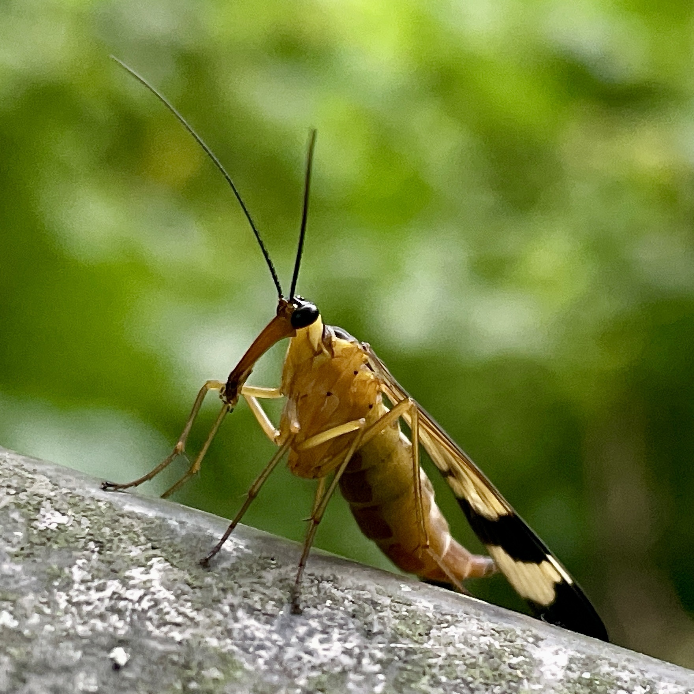
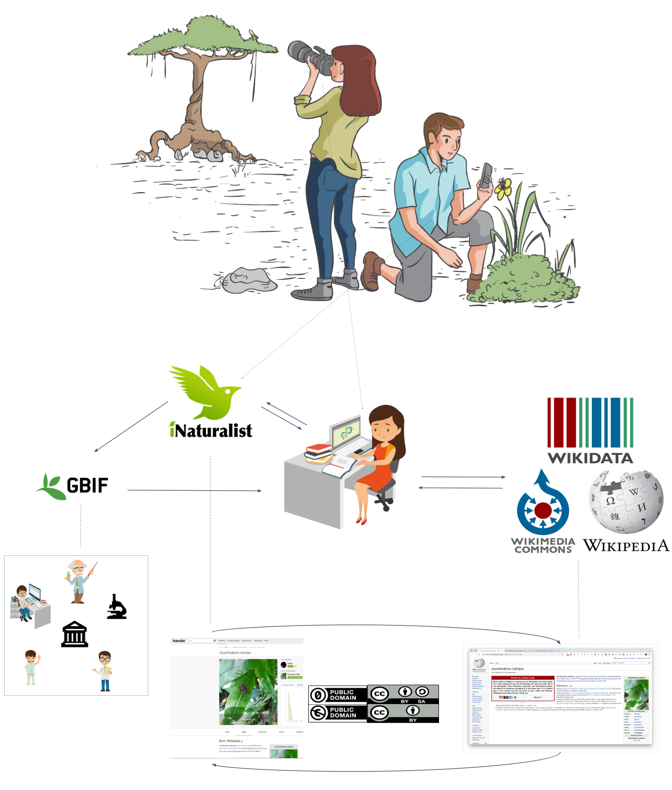

# Part 1: Report on Biohackathon 24 WikiBlitz

## Introduction
During Biohackathon 24 in Fukushima, we organized a WikiBlitz, a term derived from combining "BioBlitz" and "Wiki." A BioBlitz is an event aimed at identifying as many species as possible within a defined area over a limited period, while "Wiki" refers to the Wikimedia ecosystem, which includes platforms such as Wikipedia, Wikidata, and Wikimedia Commons. 

For this event, we utilized the iNaturalist platform to collect biodiversity observations. iNaturalist is a citizen science project that facilitates the documentation and sharing of biodiversity observations on a global scale. It allows users to set appropriate licenses for their contributions and offers an extensive API for accessing data, making it a suitable tool for integrating observations into Wikimedia projects.

The workflow involves recording observations using the iNaturalist mobile app or web platform. Once these observations are verified by the iNaturalist community and shared under a compatible license, they can be uploaded to Wikimedia Commons and integrated into Wikimedia projects. This can be done manually using the Wikimedia Commons upload form, although this approach can be time-intensive. To streamline the process, members of the **[Wikimedia Biodiversity Project](https://www.wikidata.org/wiki/Wikidata:WikiProject_Biodiversity)** have developed tools such as **[iNaturalist2Commons](https://tools.wmflabs.org/inaturalist2commons/)**. This tool automates much of the upload process by using the iNaturalist API to retrieve observation data and metadata and transferring it directly to Wikimedia Commons, where metadata is included in the image descriptions.

Once uploaded, these contributions serve multiple purposes. Images can illustrate Wikipedia articles, and structured metadata can enhance existing Wikidata entries or support the creation of new ones for species not yet represented in Wikidata. This approach facilitates the enrichment of the Wikimedia ecosystem with high-quality biodiversity data.

Participation in a WikiBlitz is intentionally accessible, allowing contributions at varying levels. These range from recording observations to completing the full cycle of integrating data into Wikimedia projects. Even at the most basic level—observing and sharing data with a suitable license—participants contribute significantly by providing resources that can later be utilized by the broader Wikimedia community. For more engaged participants, this process can be extended to include curating data, writing Wikipedia articles, and linking entries across Wikimedia platforms.

This report outlines the setup and methodology of the WikiBlitz, the data collection process, and its integration into the Wikimedia ecosystem.

## Setup of the WikiBlitz
### Setting up Accounts
Depending on the level of engagement, participants need to set up accounts. The account for iNaturalist is mandatory for all users. For those users who want to also contribute knowledge to the Wikimedia ecosystem, also
need a Wikimedia account, which is any account on any of the Wikimedia systems (e.g. Wikipedia, Commons, or Wikidata). 
on both iNaturalist and any of the wikimedia platforms.

#### iNaturalist Account
Accounts can be registered at: [https://www.inaturalist.org/signup](https://www.inaturalist.org/signup). It is best to sign up for iNaturalist on a desktop computer because the default license is not compatible with sharing on Wikipedia. Changing the license to a compatible one is either impossible or significantly more difficult on mobile devices (details in the next section).

After setting the appropriate license, you can use the iNaturalist app to record observations. Alternatively, you can use a camera and upload your observations later via the iNaturalist website. This is especially useful in areas with poor internet access.

If using a camera, ensure you record the location, date, and time of each observation. This can be done with a GPS device, the camera’s built-in GPS (if available), or a companion phone app that logs the camera’s location.
#### Wikimedia Account

The WikiBlitz setup involved using iNaturalist for observation collection and integration into the Wikimedia ecosystem. Observations were made in the area surrounding the Biohackathon 24 location. Additional metadata, such as species identification and observation quality, were added, and the collected data were shared in the Wikimedia platforms (Commons, Wikidata, Wikipedia).

## Methodology
We focused on gathering observations using the iNaturalist app. Observations included data like location, date, and time. iNaturalist's API allowed for seamless integration into the Wikimedia projects. The goal was to enrich Wikipedia articles, Wikidata entries, and Wikimedia Commons with biodiversity data.

## Results
During the Biohackathon24 WikiBlitz, a total of 109 observations were collected, covering 64 different species. The table below summarizes the key statistics:

| Observations | Species | Identifiers | Observers |
|--------------|---------|-------------|-----------|
| 109          | 64      | 32          | 8         |

The observations were made by eight participants and covered a diverse range of species. These observations were shared under appropriate licenses to facilitate their integration into Wikimedia projects. 
Initially the observations were either annotated by the observers, or suggested by the iNaturalist ML model. Gradually, the observations were then verified by the iNaturalist community. On February 1st, 2025, 35% of the observations were verified to the extend that they were considered research grade. The Data Quality Assessment on iNaturalist determines an observation’s accuracy, completeness, and suitability for sharing. Observations that include a date, location, and media (photo or sound) and are of wild organisms are considered verifiable and labeled “Needs ID” until they either reach Research Grade (when 2/3 of the community agrees on a species-level ID or lower) or are marked Casual due to issues like incorrect date, location, or evidence of a captive/cultivated organism. Research Grade status can shift back to “Needs ID” if the community re-evaluates the identification, requires more input, or if systemic patterns suggest the organism is not wild.
Different tools exist to reuse the iNaturalist data in the Wikimedia ecosystem. Most if not all only consider observations that are deemed research grade. This is because the data quality of the observations is considered to be higher. However, caution should still be taken when reusing the data, as the data quality can still be debatable.
With this metric in place, we can argue that this Wikiblitz lead to at least 35% of its observations to be avaible for reuse in the Wikimedia ecosystem.

## New taxa description on Wikipedia
Currently, in all language versions of Wikipedia, there are still many taxa not described. iNaturalist uses the English Wikipedia as its source for the taxon descriptions. If a taxon is not described in the English Wikipedia, the iNaturalist community is invited to start, what is called, a stub. This is a short article that can be expanded by the community. The iNaturalist platform will provide a short template that can be used to start such a stub (Figure 1).

Since the purpose of a WikiBlitz is to enrich the Wikimedia ecosystem with open contribution from iNaturalist, it is also important to consider the creation of new taxa descriptions on Wikipedia. Identifying which taxa description observed during the WikiBlitz can be tedious, since it requires manual checking of each observation. However, for this purpose a jupyter notebook was created that uses both Wikidata and the iNaturalist API to identify which taxa descriptions are missing on Wikipedia. This notebook can be found at [the Wikiproject Biodiversity stubmaker](https://github.com/wikiproject-biodiversity/taxonname-wpstubmaker). At the time of writing, 7 out of the 38 "research grade" observations from the BH24JP WikiBlitz were not described on Wikipedia. This means that 18% of the observations could be used to start new taxa descriptions on Wikipedia, using observations done during the DBCLS Biohackathon 2024.

### Licenses
The iNaturalist platform uses a default license, which is the CC-BY-NC license. This license is not compatible with Wikimedia projects, which require a CC0, CC-BY or CC-BY-SA license. Fortunatly, iNaturalist allows users to chance the licenses under which users would like to release their observations. The first step in participating in a WikiBlitz is to set the license for the observations to a compatible license. Changing this is a bit hidden in the settings of the iNaturalist platform and requires a bit of searching. Doing so is crucial for integrating data into Wikimedia projects, as it ensures compliance with licensing requirements. iNaturalist applies three levels of licenses to observations. There is a license set for the metadata, the images taken and the sounds recorded. The default license for all three is CC-BY-NC. When changing licenses, it is important to consider all three licenses. When only the metadata license is applied, the images can still not be used in Wikimedia projects.
The lack of an intuitive way to change the license of observations in the iNaturalist apps remains a bottleneck for an effective reuse of the iNaturalist data in the Wikimedia ecosystem, and other open knowledge platforms. Changing the default license to a more open license would facilitate better reuse of observational data from iNaturalist. 
The iNaturalist platform allows users to set licenses for their observations. This feature is crucial for integrating data into Wikimedia projects, as it ensures compliance with licensing requirements. Observations collected during the WikiBlitz were shared under appropriate licenses to facilitate their use in Wikimedia content.

## Discussion
The WikiBlitz highlighted how iNaturalist and Wikimedia communities can collaborate to document biodiversity. The data collected enriched Wikimedia content and showcased the power of citizen science in contributing to open knowledge platforms. However, the number of observations were limited due to the short duration of the event, but were sufficient to demonstrate the potential of such collaborations and still let to a sufficient number of observations that could be reused in the Wikimedia ecosystem. Future WikiBlitz events aligned with Biohackathons should aim to expand collaboration and streamline data collection and integration processes. This could involve developing tools to automate the process of identifying taxa descriptions missing on Wikipedia and integrating iNaturalist data into Wikimedia projects. Additionally, raising awareness among iNaturalist users about the importance of setting compatible licenses for observations would enhance the reuse of data in the Wikimedia ecosystem.
In Part 2 of this report we provide a tutorial for future WikiBlitz events, outlining the steps to prepare, observe, and integrate data into the Wikimedia ecosystem.

# Part 2: Tutorial for future WikiBlitz events

## Introduction to a WikiBlitz
A WikiBlitz combines citizen science and Wikimedia projects to document biodiversity. The iNaturalist platform is used for collecting observations, which are then integrated into Wikimedia projects such as Wikipedia, Wikidata, and Wikimedia Commons. Beyond its scientific and educational value, a WikiBlitz can also be a fun and engaging activity for any conference, event, wedding, or birthday party. It adds an interactive, outdoor element that encourages exploration, collaboration, and learning while contributing to open knowledge and biodiversity conservation. Whether guests are casually identifying species in a park, competing to find the most unusual organism, or working together to improve Wikipedia articles, a WikiBlitz turns any gathering into an entertaining experience with a lasting scientific impact.
## Step-by-step guide for a WikiBlitz

### Preparation phase
1.	Create accounts on iNaturalist and Wikimedia.
2. Set compatible observation licenses on iNaturalist.
3.	Identify target species and locations.
4.	Coordinate with local biodiversity experts or WikiProjects.

#### Create accounts on iNaturalist and Wikimedia
To participate in the WikiBlitz, you need at least an iNaturalist account. A Wikimedia account is also recommended.

##### Create an iNaturalist account: https://www.inaturalist.org/signup.
While iNaturalist is mainly used via mobile, we recommend signing up on a desktop because some settings (such as licenses) can only be changed there.

##### Create a Wikimedia account: https://www.wikidata.org/w/index.php?title=Special:CreateAccount.
* Wikimedia accounts work across multiple platforms, including Wikidata, Wikipedia, and Wikimedia Commons.
* Since we focus on linked data, we suggest creating an account via Wikidata.

#### Configure observation licenses on iNaturalist
By default, iNaturalist assigns three different licenses: one for images, one for sounds, and one for metadata. The default CC-BY-NC license is **not** compatible with Wikimedia projects.
To participate effectively in the WikiBlitz, change all three licenses to CC0, CC-BY, or CC-BY-SA by following these steps:
1. Go to the settings of your iNaturalist account.
2. Locate the license settings for metadata, images, and sounds.
3. Select one of the compatible licenses:
   * CC0: Public domain dedication
   * CC-BY: Attribution required
   * CC-BY-SA: Attribution required, share-alike
4. **Important** Save the changes to apply the new licenses.

Since license settings can only be changed on the desktop version of iNaturalist, we recommend signing up via desktop or laptop.

#### Observe and collect (meta) data
Once accounts and licenses are set up, you can start collecting observations using iNaturalist. There are two methods:
1. Direct observation via the iNaturalist app (recommended for real-time submissions).
2. Uploading observations later via the iNaturalist website (useful in areas with poor internet connectivity).

##### Using a camera for Oobservations
If using a standalone camera, ensure you record the location using:
* A GPS-enabled camera, or
* A GPS device (or a smartphone app that logs GPS coordinates).
Most mobile phone cameras provide sufficient quality for Wikimedia projects. internet access is limited, you can upload observations later both on the website and the app. 

#### Using machine learning to identify species
iNaturalist provides machine learning-based species suggestions to help identify observations.
* Use with caution: The AI model is not always accurate.
When unsure, it’s better to classify at a higher taxonomic level (e.g., “Fish”, “Fungi”, “Birds”) to allow experts to refine the identification later.

### Contributing to the Wikimedia ecosystem
During the WikiBlitz, we identified 7 species that lacked Wikipedia articles, including **Panorpa japonica** [Source](https://www.inaturalist.org/observations/238383248)

#### Uploading observations to Wikimedia Commons
Observations need to be uploaded to Wikimedia Commons, the media repository for Wikipedia.

##### Uploading with iNaturalist2Commons
Instead of manually uploading images, we use the [iNaturalist2Commons](https://commons.wikimedia.org/wiki/User:Kaldari/iNaturalist2Commons) tool:
* Fetches iNaturalist observations via its API.
* Includes metadata automatically.
* Uploads images efficiently, especially useful for multiple uploads.

Using this tool, we uploaded an example  [observation](https://commons.wikimedia.org/wiki/File:Panorpa_japonica_424396056.jpg) to Wikimedia commons. 
If after a succesfull installation the tool doesn't work for a specific species, the issue may be due to missing species coverage on Wikidata (next step).

#### Verifying species coverage on Wikidata.
Before integrating species into Wikipedia, check if they are properly documented on Wikidata.
For Panorpa japonica, its Wikidata item is: [Q3362412](https://www.wikidata.org/wiki/Q3362412).

Ensure the item at least includes:
* iNaturalist taxon ID (P3151)
* GBIF taxon ID (P846)
* Image (P18): If missing, add the uploaded Wikimedia Commons image.

#### Create a Wikipedia article
Once species data is available on Wikidata and one or more verified images exist on Wikimedia Commons a Wikipedia article can be created.

A script can generate a Wikipedia stub by pulling information from:
	•	iNaturalist
	•	GBIF
	•	Biodiversity Heritage Library

One example of such a script is[the Wikiproject Biodiversity stubmaker](https://github.com/wikiproject-biodiversity/taxonname-wpstubmaker) mentioned earlier 
For Panorpa japonica, one observation observed by one of the authors during the biohackathon, the stub was manually extended and now lives on [Wikipedia](https://en.wikipedia.org/wiki/Panorpa_japonica).

## Tips and best practices
- Organize observations efficiently and ensure high-quality photos.
- Coordinate with the [WikiProject Biodiversity](https://www.wikidata.org/wiki/Wikidata:WikiProject_Biodiversity).
- Avoid common pitfalls, such as incomplete metadata or incorrect species identification.

## Conclusion
WikiBlitz events are an effective and entertaining way to document biodiversity and contribute to Wikimedia's open knowledge base. By following this guide, future organizers can successfully conduct their own WikiBlitz events and integrate their findings into the Wikimedia ecosystem. WikiBlitzes are also a nice demonstrator of how data and knowledge can be shared between different platforms and communities.

## Acknowledgements
We would like to thank the organizers of BioHackathon 24 and the WikiProject Biodiversity community for their contributions. We also appreciate the wider iNaturalist community for their dedication to documenting global biodiversity.
