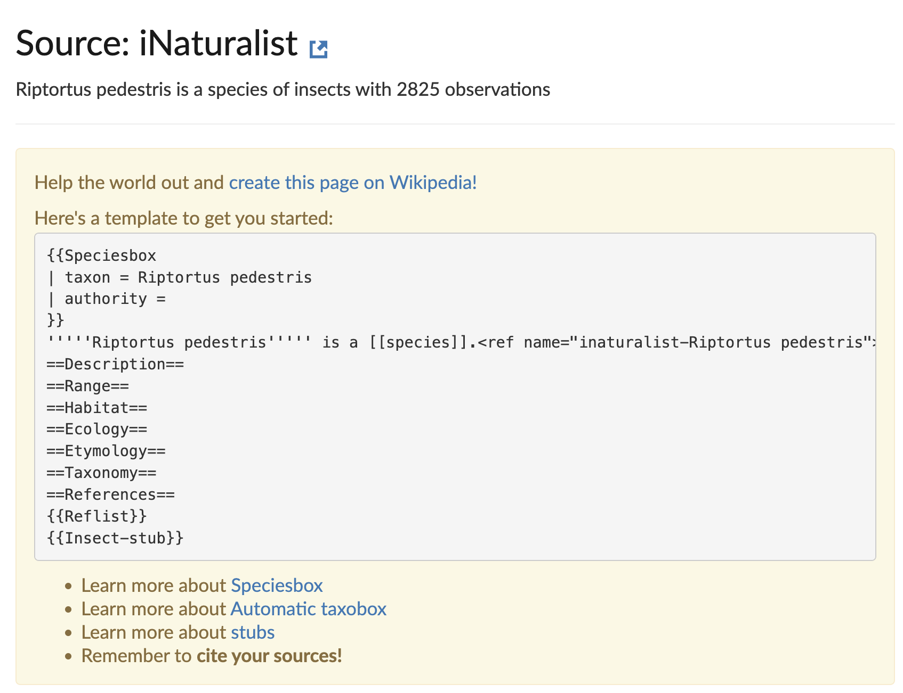

# Part 1: Report on Biohackathon 24 WikiBlitz

## Introduction
During Biohackathon 24 in Fukushima, we organized a WikiBlitz, a term derived from combining "BioBlitz" and "Wiki." A BioBlitz is an event aimed at identifying as many species as possible within a defined area over a limited period, while "Wiki" refers to the Wikimedia ecosystem, which includes platforms such as Wikipedia, Wikidata, and Wikimedia Commons. 

For this event, we utilized the iNaturalist platform to collect biodiversity observations. iNaturalist is a citizen science project that facilitates the documentation and sharing of biodiversity observations on a global scale. It allows users to set appropriate licenses for their contributions and offers an extensive API for accessing data, making it a suitable tool for integrating observations into Wikimedia projects.

The workflow involves recording observations using the iNaturalist mobile app or web platform. Once these observations are verified by the iNaturalist community and shared under a compatible license, they can be uploaded to Wikimedia Commons and integrated into Wikimedia projects. This can be done manually using the Wikimedia Commons upload form, although this approach can be time-intensive. To streamline the process, members of the **[Wikimedia Biodiversity Project](https://www.wikidata.org/wiki/Wikidata:WikiProject_Biodiversity)** have developed tools such as **[iNaturalist2Commons](https://tools.wmflabs.org/inaturalist2commons/)**. This tool automates much of the upload process by using the iNaturalist API to retrieve observation data and metadata and transferring it directly to Wikimedia Commons, where metadata is included in the image descriptions.

Once uploaded, these contributions serve multiple purposes. Images can illustrate Wikipedia articles, and structured metadata can enhance existing Wikidata entries or support the creation of new ones for species not yet represented in Wikidata. This approach facilitates the enrichment of the Wikimedia ecosystem with high-quality biodiversity data.

Participation in a WikiBlitz is intentionally accessible, allowing contributions at varying levels. These range from recording observations to completing the full cycle of integrating data into Wikimedia projects. Even at the most basic level—observing and sharing data with a suitable license—participants contribute significantly by providing resources that can later be utilized by the broader Wikimedia community. For more engaged participants, this process can be extended to include curating data, writing Wikipedia articles, and linking entries across Wikimedia platforms.

This report outlines the setup and methodology of the WikiBlitz, the data collection process, and its integration into the Wikimedia ecosystem.

## Setup of the WikiBlitz
### Setting up Accounts
Depending on the level of engagement, participants need to set up accounts. The account for iNaturalist is mandatory for all users. For those users who want to also contribute knowledge to the Wikimedia ecosystem, also
need a Wikimedia account, which is any account on any of the Wikimedia systems (e.g. Wikipedia, Commons, or Wikidata). 
on both iNaturalist and any of the wikimedia platforms.

#### iNaturalist Account
Accounts can be registered at: [https://www.inaturalist.org/signup](https://www.inaturalist.org/signup). It is recommended to signup to iNaturalist on its desktop version. This is because the default license of iNaturalist is incompatible with sharing on Wikipedia. Changing to a compatible license is not possible or less straightforward than on mobile devices. More on this in the next section.
Once the appropiate license is set, the observations can be made using the iNaturalist app. It is also possible to use cameras and upload the observations later on the iNaturalist website. This is especially useful when the observations are made in areas without good internet connection. When using a camera, it is important to record the location, date and time of the observations. This can be done by using a GPS device or by using the GPS functionality of the camera, some camera models come with a phone app that can be used to record the GPS location of the camera.

#### Wikimedia Account

The WikiBlitz setup involved using iNaturalist for observation collection and integration into the Wikimedia ecosystem. Observations were made in the area surrounding the Biohackathon 24 location. Additional metadata, such as species identification and observation quality, were added, and the collected data were shared in the Wikimedia platforms (Commons, Wikidata, Wikipedia).

## Methodology
We focused on gathering observations using the iNaturalist app. Observations included data like location, date, and time. iNaturalist's API allowed for seamless integration into the Wikimedia projects. The goal was to enrich Wikipedia articles, Wikidata entries, and Wikimedia Commons with biodiversity data.

## Results
During the Biohackathon24 WikiBlitz, a total of 109 observations were collected, covering 64 different species. The table below summarizes the key statistics:

| Observations | Species | Identifiers | Observers |
|--------------|---------|-------------|-----------|
| 109          | 64      | 32          | 8         |

The observations were made by eight participants and covered a diverse range of species. These observations were shared under appropriate licenses to facilitate their integration into Wikimedia projects. 
Initially the observations were either annotated by the observers, or suggested by the iNaturalist ML model. Gradually, the observations were then verified by the iNaturalist community. On February 1st, 2025, 35% of the observations were verified to the extend that they were considered research grade. The Data Quality Assessment on iNaturalist determines an observation’s accuracy, completeness, and suitability for sharing. Observations that include a date, location, and media (photo or sound) and are of wild organisms are considered verifiable and labeled “Needs ID” until they either reach Research Grade (when ⅔ of the community agrees on a species-level ID or lower) or are marked Casual due to issues like incorrect date, location, or evidence of a captive/cultivated organism. Research Grade status can shift back to “Needs ID” if the community re-evaluates the identification, requires more input, or if systemic patterns suggest the organism is not wild.
Different tools exist to reuse the iNaturalist data in the Wikimedia ecosystem. Most if not all only consider observations that are deemed research grade. This is because the data quality of the observations is considered to be higher. However, caution should still be taken when reusing the data, as the data quality can still be debatable.
With this metric in place, we can argue that this Wikiblitz lead to at least 35% of its observations to be avaible for reuse in the Wikimedia ecosystem.

## New taxa description on Wikipedia
Currently, in all language versions of Wikipedia, there are still many taxa not described. iNaturalist uses the English Wikipedia as its source for the taxon descriptions. If a taxon is not described in the English Wikipedia, the iNaturalist community is invited to start, what is called, a stub. This is a short article that can be expanded by the community. The iNaturalist platform will provide a short template that can be used to start such a stub (Figure 1).

Since the purpose of a WikiBlitz is to enrich the Wikimedia ecosystem with open contribution from iNaturalist, it is also important to consider the creation of new taxa descriptions on Wikipedia. Identifying which taxa description observed during the WikiBlitz can be tedious, since it requires manual checking of each observation. However, for this purpose a jupyter notebook was created that uses both Wikidata and the iNaturalist API to identify which taxa descriptions are missing on Wikipedia. This notebook can be found at [the Wikiproject Biodiversity stubmaker](https://github.com/wikiproject-biodiversity/taxonname-wpstubmaker). At the time of writing, 7 out of the 38 "research grade" observations from the BH24JP WikiBlitz were not described on Wikipedia. This means that 18% of the observations could be used to start new taxa descriptions on Wikipedia, using observations done during the DBCLS Biohackathon 2024.

### Licenses
The iNaturalist platform uses a default license, which is the CC-BY-NC license. This license is not compatible with Wikimedia projects, which require a CC0, CC-BY or CC-BY-SA license. Fortunatly, iNaturalist allows users to chance the licenses under which users would like to release their observations. The first step in participating in a WikiBlitz is to set the license for the observations to a compatible license. Changing this is a bit hidden in the settings of the iNaturalist platform and requires a bit of searching. Doing so is crucial for integrating data into Wikimedia projects, as it ensures compliance with licensing requirements. iNaturalist applies three levels of licenses to observations. There is a license set for the metadata, the images taken and the sounds recorded. The default license for all three is CC-BY-NC. When changing licenses, it is important to consider all three licenses. When only the metadata license is applied, the images can still not be used in Wikimedia projects.
The lack of an intuitive way to change the license of observations in the iNaturalist apps remains a bottleneck for an effective reuse of the iNaturalist data in the Wikimedia ecosystem, and other open knowledge platforms. Changing the default license to a more open license would facilitate better reuse of observational data from iNaturalist. 
The iNaturalist platform allows users to set licenses for their observations. This feature is crucial for integrating data into Wikimedia projects, as it ensures compliance with licensing requirements. Observations collected during the WikiBlitz were shared under appropriate licenses to facilitate their use in Wikimedia content.

## Discussion
The WikiBlitz highlighted how iNaturalist and Wikimedia communities can collaborate to document biodiversity. The data collected enriched Wikimedia content and showcased the power of citizen science in contributing to open knowledge platforms. However, the number of observations were limited due to the short duration of the event, but were sufficient to demonstrate the potential of such collaborations and still let to a sufficient number of observations that could be reused in the Wikimedia ecosystem. Future WikiBlitz events aligned with Biohackathons should aim to expand collaboration and streamline data collection and integration processes. This could involve developing tools to automate the process of identifying taxa descriptions missing on Wikipedia and integrating iNaturalist data into Wikimedia projects. Additionally, raising awareness among iNaturalist users about the importance of setting compatible licenses for observations would enhance the reuse of data in the Wikimedia ecosystem.
In Part 2 of this report we provide a tutorial for future WikiBlitz events, outlining the steps to prepare, observe, and integrate data into the Wikimedia ecosystem.

---

# Part 2: Tutorial for Future WikiBlitz Events

## Introduction to a WikiBlitz
A WikiBlitz combines citizen science and Wikimedia projects to document biodiversity. The iNaturalist platform is used for collecting observations, which are then integrated into Wikimedia projects such as Wikipedia, Wikidata, and Wikimedia Commons.

## Step-by-Step Guide

### Preparation Phase
1. Set up accounts on iNaturalist and Wikimedia.
2. Configure observation licenses on iNaturalist.
3. Identify target species and locations.
4. Coordinate with local biodiversity experts or WikiProjects.

#### Set up accounts on iNaturalist and Wikimedia platforms
As a participant in the wikiblitz, you need at least an account on iNaturalist, but an account on a Wikimedia platform is adviced. For iNaturalist the WikiBlitz particpant can create an account at [https://www.inaturalist.org/signup](https://www.inaturalist.org/signup). While iNaturalist is mostly used on its mobile app, tt is recommended to signup to iNaturalist on its desktop version, why will be discussed shortly. The Wikimedia platform includes various crowd sourcing platforms. It is sufficient to have an account on one of the Wikimedia platforms, as the accounts are shared across the different platforms.
In case you don't have a Wikimedia account yet, you can create one at [https://www.wikidata.org/w/index.php?title=Special:CreateAccount](https://www.wikidata.org/w/index.php?title=Special:CreateAccount). Due to our preference for linked data we took Wikidata as the platform to create an account on.
With that Wikidata account you can log into the other Wikimedia platforms, like Wikipedia and Wikimedia Commons, which you need to complete the WikiBlitz.

#### Configure observation licenses on iNaturalist
By default iNaturalist comes with three licenses. One for the images, one for the sounds and one for the metadata. The default license is the CC-BY-NC license. This license is not compatible with the Wikimedia ecosystem. A chance of license is advised to effectively participate in the WikiBlitz. To change the license, you need to go to the settings of your iNaturalist account. In the settings you can change the license for the metadata, the images and the sounds of the observations. It is important to change all three licenses to a compatible license. The compatible licenses are CC0, CC-BY and CC-BY-SA.
To our knowledge it is only possible to change the applicable licenses on the desktop version of iNaturalist. This is why we recommend to signup to iNaturalist on its desktop version.
Once ready with the accounts, you can start with the data collection phase.

### Data Collection Phase
Adding observations to iNaturalist can be either directly observing the organisms through the iNaturalist app or by uploading media later. The observations should include metadata such as location, date, and time. It is important to ensure the observations are of high quality and include relevant information for later integration into Wikimedia projects.
When using camera's to observe it is also recommended to either use a camera with GPS functionality or to use a GPS device to record the location of the observations. This is important for the quality of the observations and for the integration of the observations into the Wikimedia ecosystem. 
The photos made by most mobile phones are of sufficient quality to be used in the Wikimedia ecosystem. Cameras can be practical in regions with limited internet connection. The observations can be uploaded later on the iNaturalist website.

### Using Machine Learning to Identify Species
iNaturalist uses machine learning models to suggest species identifications based on the observations. This can be helpful for participants who are not experts in species identification, but should also be with care. The models often don't lead to accurate suggestions. When in doubt, it can also be sufficient to annotate the observations by taxa higher in the taxonomic branch. Just calling the observations, e.g. Fish, Fungi, Birds, etc, can already be sufficient to trigger different communities to verify the observations.

### Contribute to the Wikimedia Ecosystem
As described earlier, we observed 7 species which lack a Wikipedia article. One of these species is the **Panorpa japonica** [Source](https://www.inaturalist.org/observations/238383248)

#### Uploading Observations to Wikimedia Commons
First we upload this observation to [Wikmedia Commons](https://commons.wikimedia.org/wiki/Main_Page). This can be done by using the main Upload Wizard. However, this requires a lot of manual work. A more efficient way is to use the [iNaturalist2Commons](https://commons.wikimedia.org/wiki/User:Kaldari/iNaturalist2Commons) tool. This uses the iNaturalist API to retrieve the observation combined with needed metadata and uploads it to Wikimedia Commons. The metadata is included in the image description. This tool is especially useful when uploading multiple observations.
Using the iNaturalist2Commons tool, we uploaded one [observation](https://commons.wikimedia.org/wiki/File:Panorpa_japonica_424396056.jpg) to Wikimedia commons. 
If iNaturalist2Commons doesn't work for a given species, it can be that the coverage of the species on Wikidata needs to be verified first. 

#### Verify coverage on Wikidata.
Next we verified if the species is sufficiently covered on Wikidata. This is the case if links exist to iNaturalist and GBIF. These are made by using the following properties iNaturalist taxon ID (P3151) and GBIF taxon ID (P846). The mapping to Wikimedia commons is made using the sitelinks section of Wikidata which allows linking other Wikimedia projects. The Wikidata entry for the Panorpa japonica can be found [here](https://www.wikidata.org/wiki/Q3362412).
If the Wikidata Item does not have a statement with the property Image (P18), the image can be added to the Wikidata item. This can be done by clicking on the "Add statement" button and selecting the property "Image". The image can be added by using the "value" field. The image can be found on Wikimedia Commons and can be added by using the "search" function in the "value" field. The image can be added by clicking on the "add" button next to the image. The image will be added to the Wikidata item. The image can be found on Wikimedia Commons and can be added by using the "search" function in the "value" field. The image can be added by clicking on the "add" button next to the image. The image will be added to the Wikidata item. The image can be found on Wikimedia Commons and can be added by using the "search" function in the "value" field. The image can be added by clicking on the "add" button next to the image. The image will be added to the Wikidata item. The image can be found on Wikimedia Commons and can be added by using the "search" function in the "value" field. The image can be added by clicking on the "add" button next to the image. The image will be added to the Wikidata item. The image can be found on Wikimedia Commons and can be added by using the "search" function in the "value" field. The image can be added by clicking on the "add" button next to the image. The image will be added to the Wikidata item. The image can be found on Wikimedia Commons and can be added by using the "search" function in the "value" field. The image can be added by clicking on the "add" button next to the image. The image will be added to the Wikidata item. The image can be found on Wikimedia Commons and can be added by using the link already known from the previous step.

#### Create a Wikipedia article
The notebook mentioned earlier can be used to build a Wikipedia stub. It collects the information from iNaturalist, GBIF and the Biodiversity Heritage Library to create a stub. The stub is formated in the Wikitext format used by Wikipedia. The stub can be copied and pasted into a new Wikipedia article. However as is, isn't sufficient to create a new article. Finalising the stub requires a bit more work and either experience in creating Wikipedia articles or supervision by a seasoned Wikipedia editor. For the Panorpa japonica, the stub was manually extended and now lives on [Wikipedia](https://en.wikipedia.org/wiki/Panorpa_japonica).

## Tips and Best Practices
- Organize observations efficiently and ensure high-quality photos.
- Coordinate with the [WikiProject Biodiversity](https://www.wikidata.org/wiki/Wikidata:WikiProject_Biodiversity).
- Avoid common pitfalls, such as incomplete metadata or incorrect species identification.

## Conclusion
WikiBlitz events are an effective and entertaining way to document biodiversity and contribute to Wikimedia's open knowledge base. By following this guide, future organizers can successfully conduct their own WikiBlitz events and integrate their findings into the Wikimedia ecosystem. WikiBlitzes are also a nice demonstrator of how data and knowledge can be shared between different platforms and communities.

---

## Acknowledgements
We would like to thank the organizers of BioHackathon 24 and the WikiProject Biodiversity community for their contributions. We also appreciate the wider iNaturalist community for their dedication to documenting global biodiversity.
